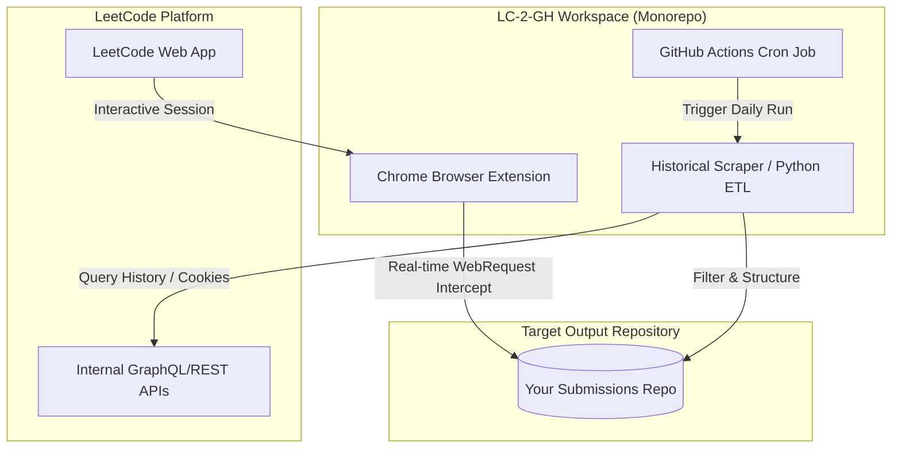

# 🚀 LC-2-GH (LeetCode-to-GitHub Sync Platform)

[](https://www.python.org/)
[](#)
[](#)
[](#)

**LC-2-GH** is a comprehensive, monorepo synchronization tool designed to automatically back up and track your LeetCode problem-solving progress directly into a target GitHub repository. 

Rather than relying purely on manual syncs, **LC-2-GH** combines a high-performance **Python ETL pipeline** (for historical data sync and automated daily CRON backups) with a modern **Manifest V3 Browser Extension** (for live, real-time submission tracking).

---

## 🏛️ System Architecture & Workflow



---

## 📁 Repository Structure

```text
LC-2-GH/
├── .github/workflows/      # Automated daily sync workflows
│   └── daily-sync.yml      # Runs the scraper automatically every night
├── historical-scraper/     # Python ETL tool for historical scraping & batch pushes
│   ├── src/                # Scraper, Metadata fetcher, and Git uploader source files
│   ├── data/               # Watermark caches (idempotency state)
│   ├── main.py             # CLI Orchestrator
│   └── requirements.txt    # Python dependencies
├── new-sub-extension/      # Chrome/Edge Manifest V3 extension boilerplate
│   ├── assets/             # Extension icons and images
│   ├── src/                # Background worker, popup interfaces, storage libraries
│   └── manifest.json       # Extension configuration
└── README.md               # You are here
```

---

## 🔧 Core Components & Features

### 1. Historical Scraper & CLI (`/historical-scraper`)
A highly optimized Extract, Transform, Load (ETL) script written in Python to fetch all your historical submissions.
*   **Idempotency & Watermarks:** Uses watermarking (`submissions_cache.json`) and metadata caches (`submissions_updated.json`) to skip problems we've already synced, saving resources and bypassing rate-limiting issues.
*   **Anti-Bot Bypass:** Utilizes authenticated user session cookies to bypass aggressive CDN protection (like Cloudflare).
*   **Auto-Provisioning:** Uses the GitHub REST API to automatically create a private target repository if it doesn't already exist on your profile.

### 2. Live Sync Browser Extension (`/new-sub-extension`)
A lightweight Chromium browser extension built on Manifest V3.
*   **Background Worker:** Intercepts outgoing submission payloads to detect when a solution is `Accepted`.
*   **Direct Push:** Communicates directly with the GitHub API to update your repository from your active browser session without requiring a local Git install.

### 3. Automated Daily Backups (`.github/workflows`)
A pre-configured GitHub Action that runs daily to scan your profile for new submissions.
*   Keeps your cache updated and handles Git commits automatically.
*   Uses repository secrets to securely supply authentication parameters (`LEETCODE_SESSION`, `GITHUB_TOKEN`).

---

## 🚀 Getting Started

### Local CLI Scraper Setup
1. Clone the repository and navigate to `/historical-scraper`:
   ```bash
   cd historical-scraper
   ```
2. Create and activate a Python virtual environment:
   ```bash
   python -m venv .venv
   .\.venv\Scripts\activate  # Windows
   # source .venv/bin/activate  # macOS/Linux
   ```
3. Install the dependencies:
   ```bash
   pip install -r requirements.txt
   ```
4. Create a `.env` file matching the template:
   ```env
   LEETCODE_SESSION=your_session_cookie
   LEETCODE_CSRF_TOKEN=your_csrf_token
   GITHUB_TOKEN=your_personal_access_token
   GITHUB_ID=your_github_username
   ```
5. Run the orchestrator:
   ```bash
   python main.py --repo Github-Submissions
   ```

### Daily GitHub Actions Sync
1. In your GitHub repo settings, go to **Settings > Secrets and variables > Actions**.
2. Add the following repository secrets:
   *   `LEETCODE_SESSION`
   *   `LEETCODE_CSRF_TOKEN`
   *   `SYNC_GITHUB_TOKEN` (Personal Access Token with `repo` scopes)
   *   `GITHUB_ID` (Your GitHub Username)
3. The workflow runs automatically at `19:30 UTC` daily, but can also be manually triggered under the **Actions** tab.

### Loading the Browser Extension
1. Open Google Chrome (or any Chromium-based browser) and navigate to `chrome://extensions/`.
2. Toggle **Developer mode** on (top-right switch).
3. Click **Load unpacked** (top-left button).
4. Select the `/new-sub-extension` directory from this project workspace.

---

## 📂 Target Repository Output Structure

Your submissions are organized logically by their difficulty status and prefixed with zero-padded problem IDs:

```text
Github-Submissions/
├── Easy/
│   └── 0001-two-sum.py
├── Medium/
│   └── 0015-3sum.py
└── Hard/
    └── 0072-edit-distance.py
```

Each synced file includes detailed solution metadata embedded in a comment header block:
```python
"""
Problem Name: Two Sum
Difficulty: Easy
Tags: Array, Hash Table
"""

"""
Submission 1
Language: python3
Runtime: 48 ms
Memory: 15.1 MB
"""
# Your solution code goes here...
```

---

## 🗺️ Roadmap
- [x] Phase 1: Python CLI Scraper MVP (Reverse Engineered APIs & Git push automation)
- [x] Phase 2: Daily GitHub Actions workflow for zero-touch cron syncing
- [ ] Phase 3: Connect Browser Extension OAuth pipeline for token management
- [ ] Phase 4: Implement real-time submission capture in Extension Service Worker
- [ ] Phase 5: Extend platform integration to cover NeetCode and other popular coding platforms
